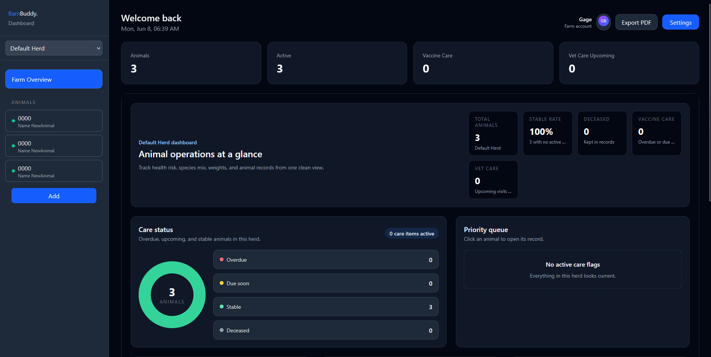
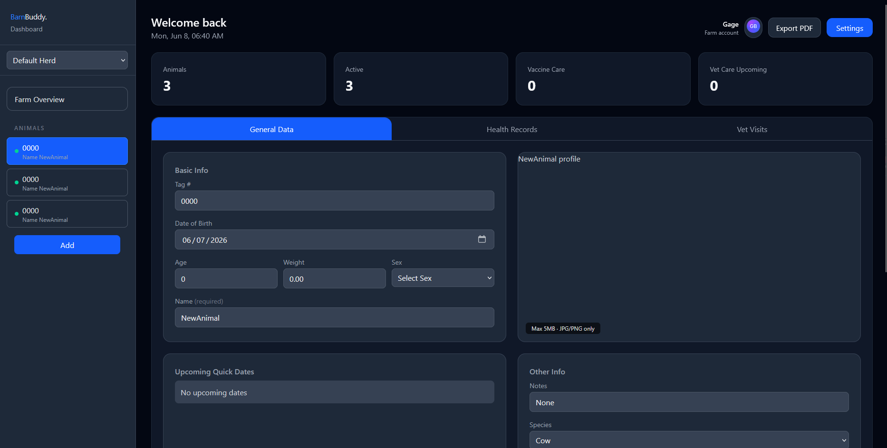

# 🐄 BarnBuddy

### Modern Livestock Management for Small Farms, FFA Students, and Hobby Producers

**BarnBuddy** is a modern livestock management web app built for small farms, FFA students, and hobby producers who need a simple way to track animals, health records, vet visits, and herd information.

Instead of using messy notebooks or scattered spreadsheets, BarnBuddy keeps everything organized in one clean dashboard.

---

## 🚀 Features

- 🐮 **Animal Management**
  - Track animal names, species, sex, birthdates, age, comments, and herd placement

- 💉 **Health Records**
  - Store health notes, weight records, status updates, and general care information

- 🩺 **Vet Visit Tracking**
  - Log vet visits, treatments, follow-up dates, and important notes

- 📅 **Herd Dashboard**
  - View animals, records, and care information from one organized dashboard

- 🔐 **Secure Authentication**
  - User accounts powered by Clerk authentication

- 🎨 **Modern UI**
  - Dark theme, clean layout, and responsive design built with React and Tailwind CSS

---

## 🛠️ Tech Stack

### Frontend
- React
- Vite
- Tailwind CSS
- Clerk Auth

### Backend
- Node.js
- Express
- PostgreSQL
- Railway

---

## 📸 Preview

### Dashboard

### General Data

---

## Website images in Cloudflare R2

Private animal photos use the `users/` namespace. Public website and admin images use `site/`.

1. Configure `R2_ACCOUNT_ID`, `R2_ACCESS_KEY_ID`, `R2_SECRET_ACCESS_KEY`, and `R2_SITE_BUCKET_NAME` in `server/.env`. Keep `R2_BUCKET_NAME` as the separate private animal-photo bucket.
2. Optionally configure `R2_PUBLIC_BASE_URL` in `server/.env` and the same URL as `VITE_R2_PUBLIC_BASE_URL` in `client/.env`.
3. Run `npm.cmd run site-images:migrate:r2` from the `server` directory.
4. Verify website images, PWA icons, and the admin media library.
5. Run `npm.cmd run site-images:cleanup:database` only after verification.

The migration keeps PostgreSQL image blobs for rollback by default and is safe to rerun. New admin uploads go directly to R2.
